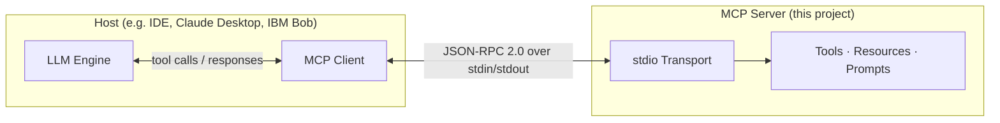
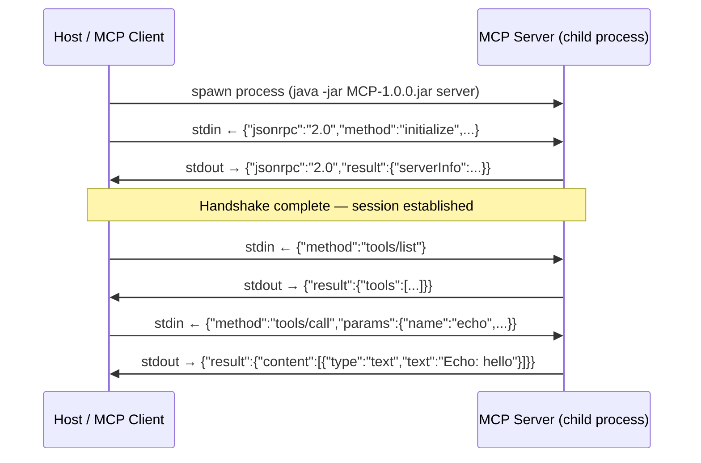
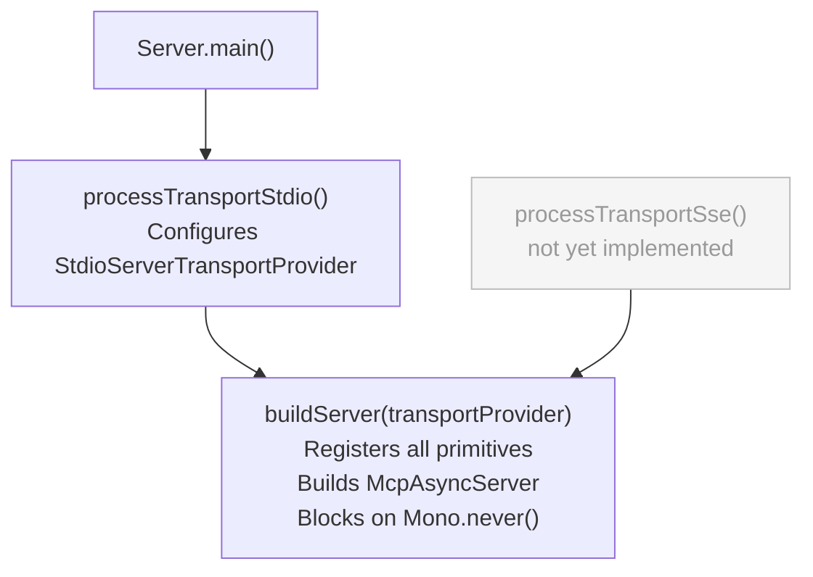
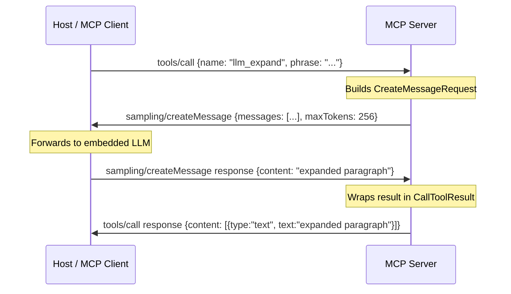

# Model Context Protocol (MCP) Java Tutorial

Welcome to the **MCP Java SDK Tutorial** repository! This project serves as a comprehensive reference implementation and step-by-step guide for developers looking to master the official [Model Context Protocol (MCP) Java SDK](https://github.com/modelcontextprotocol/java-sdk).

---

## Summary

The primary objective of this project is to provide a complete, hands-on tutorial for building, running, and diagnosing Model Context Protocol (MCP) components in a native Java environment. The project explores the full potential of the official Java MCP SDK through two primary deliverables:

1. **A Compliant MCP Server**:
   A robust, standard-compliant MCP server that exposes the four core MCP primitives: **Tools**, **Resources**, **Prompts**, and **Sampling**. The tutorial guides you through wrapping these primitives in standard I/O (stdio) or streamable HTTP/SSE transports, demonstrating how LLMs and host clients can securely interoperate with Java-based backend services.

2. **A Universal MCP Client (Feature Dumper)**:
   A native Java MCP client designed to connect to the tutorial's server, or **any other compliant MCP server**. Once connected, this client queries and dumps all available capabilities, tools, resources, and prompts exposed by the target server into a clean, structured diagnostic report. This "Feature Dumper" client acts as an essential inspection tool, similar to the Node-based MCP Inspector, but fully native to Java.

### Key Learnings & Stack

This tutorial implements the design principles and learnings from [`doc/Research.md`](doc/Research.md):
* **Modern Java Platform**: Leverages the power of **Java 21** (virtual threads, records, and pattern matching) and **Maven**.
* **Reactive Core**: Utilizes Project Reactor Netty for seamless reactive streams and SSE network communication.
* **Production-Grade Logging**: Configured with Log4j2 and SLF4J to support clean, non-conflicting diagnostics (especially when using standard I/O transport pipelines where system stdout is reserved for JSON-RPC payloads).
* **Single-POM Versioning**: Centralized dependency properties for robust and reproducible builds.

---

## Current Status & Getting Started

### Prerequisites

Ensure your local environment is configured to execute:
* Node (when using [MCP Inspector](https://modelcontextprotocol.io/docs/2026-07-28/tools/inspector/web))
* Git
* Maven
* JDK21

### Build the Project

Build the executable fat-JAR:
```bash
mvn clean package
```

### Verify the Installation

Run the packaged PoC executable to verify that the environment and core MCP classes load successfully:

```bash
java -jar target/MCP-1.0.0.jar
```

This will output the name and version of the loaded MCP schema implementation and log the diagnostics to `MCP.log`.

### Test with MCP Inspector

This command uses `npx` to download and run the latest [MCP Inspector](https://modelcontextprotocol.io/docs/2026-07-28/tools/inspector/web), which spawns the server as a child process and opens an [interactive browser UI](http://localhost:6274?MCP_INSPECTOR_API_TOKEN=8a4a2505d7b6151d0c3f846268860bad481f9c2d8edbf09523ad2cb34dc57597) for browsing and invoking its Tools, Resources, and Prompts.

```bash
npx @modelcontextprotocol/inspector@latest java -cp target/MCP-1.0.0.jar edu.java.service.Server
```

### MCP Server

This JSON snippet registers the server as a local MCP plugin inside IBM **Bob IDE** (or any other MCP-compatible host), instructing it to launch the fat-JAR via the specified Java executable whenever the `mcp-test` server connection is needed.

```json
{
  "mcpServers": {
    "mcp-test": {
      "command": "X:\\Path\\Java\\Java21\\bin\\java.exe",
      "args": [
        "-jar",
        "X:\\Path\\MCP\\target\\MCP-1.0.0.jar",
        "server"
      ],
      "disabled": false
    }
  }
}
```

### Compatibility

> *Researched on 2026-08-20. MCP host support is evolving rapidly; verify against the latest release notes of each tool.*

Not all MCP hosts implement the full specification. The table below documents which of the four MCP primitives/capabilities are supported by commonly used AI coding hosts and inspection tools.

| Host | MCP Primitive: Tools | MCP Primitive: Resources | MCP Primitive: Prompts | MCP Capability: Sampling |
|---|:---:|:---:|:---:|:---:|
| **IBM Bob** | ✅ | ✅ | ❌ | ❌ |
| **Claude Desktop** | ✅ | ✅ | ✅ | ✅ |
| **Claude Code** | ✅ | ✅ | ✅ | ❌ |
| **OpenAI Codex CLI** | ✅ | ❌ | ❌ | ❌ |
| **GitHub Copilot (VS Code)** | ✅ | ❌ | ❌ | ❌ |
| **MCP Inspector** | ✅ | ✅ | ✅ | ❌ |
| **This project's Java Client** | ✅ | ✅ | ✅ | ✅* |

> \* The Java Client in this project can declare sampling capabilities in the handshake, making it one of the few clients capable of exercising the full Sampling flow end-to-end (see `llm_expand`).

---

## Technical Documentation — stdio Transport

This section documents the current implementation: the MCP server running over the **stdio transport**. Other transports (SSE/HTTP) will be documented when implemented.

---

### MCP Architecture Overview

MCP follows a **client–host–server** model. The host is the AI application (e.g. an IDE plugin or CLI tool); it embeds the MCP client and is responsible for managing the connection to one or more MCP servers.



---

### MCP Primitives

The MCP specification defines three **primitives** that a server exposes, plus one **capability** that a server can invoke on the client:

| Concept | Type | Direction | Purpose |
|---|---|---|---|
| **Tools** | Primitive | Client calls server | Executable functions the LLM can invoke |
| **Resources** | Primitive | Client reads server | Data the LLM can read (files, DB results, …) |
| **Prompts** | Primitive | Client requests server | Reusable prompt templates |
| **Sampling** | Capability | Server calls client | Server asks the client's LLM to generate text |

---

### Stdio Transport

#### What it is

The **stdio transport** is the simplest MCP transport. The MCP client launches the server as a **child process** and communicates with it over the child's standard input (`stdin`) and standard output (`stdout`). All messages are JSON-RPC 2.0 encoded, one per line.



#### Why stdout must stay clean

Because the host reads every byte written to stdout and attempts to parse it as a JSON-RPC message, **the server must never write anything to `System.out` directly**. Even a single stray `System.out.println()` breaks the JSON-RPC framing and causes a parse error on the client side.

All server-side diagnostics are written to `System.err` (which the host does not read) and to `MCP.log` (configured via Log4j2).

---

### Code Structure

#### Entry point split: transport vs. primitives

A deliberate design decision separates transport selection from primitive registration:



This means adding a new transport in the future requires only a new `processTransport*()` method — the primitive registration in `buildServer()` is reused unchanged.

#### Factory method naming convention

Every MCP service is constructed by a dedicated private factory method. The name encodes both the MCP concept and the service name:

| Prefix | MCP concept | Example |
|---|---|---|
| `createTool*()` | Tool primitive | `createToolEcho()` |
| `createSampling*()` | Sampling capability (registered as a Tool) | `createSamplingLlmExpand()` |
| `createResource*()` | Resource primitive (concrete URI) | `createResourceInfo()` |
| `createResourceTemplate*()` | Resource Template (URI pattern, metadata only) | `createResourceTemplateEcho()` |
| `createPrompt*()` | Prompt primitive | `createPromptCodeReview()` |

The `buildServer()` method then reads as a clean index:

```java
buildServer(transport):
  // Tools
  var toolEcho        = createToolEcho();
  var toolAdd         = createToolAdd();
  var toolCurrentTime = createToolCurrentTime();
  // Sampling
  var toolLlmExpand   = createSamplingLlmExpand();
  // Resources
  var resourceInfo             = createResourceInfo();
  var resourceSystemProperties = createResourceSystemProperties();
  var resourceEchoHello        = createResourceEchoHello();
  var resourceEchoJunit        = createResourceEchoJunit();
  // Resource Templates
  var resourceTemplateEcho = createResourceTemplateEcho();
  // Prompts
  var promptCodeReview = createPromptCodeReview();
  var promptSummarise  = createPromptSummarise();

  McpServer.async(transport)
    .tools(toolEcho, toolAdd, toolCurrentTime, toolLlmExpand)
    .resources(resourceInfo, resourceSystemProperties, resourceEchoHello, resourceEchoJunit)
    .resourceTemplates(resourceTemplateEcho)
    .prompts(promptCodeReview, promptSummarise)
    .build();
```

---

### Registered MCP Primitives

#### Tools

| Name | Description |
|---|---|
| `echo` | Echoes the `message` argument back prefixed with `"Echo: "`. Smoke-test tool. |
| `add` | Parses integer arguments `a` and `b`, returns their sum. Returns an MCP error result (not a thrown exception) on parse failure. |
| `current_time` | Returns the current server UTC timestamp in ISO-8601 format. Accepts no parameters. |
| `llm_expand` | Sampling-backed tool — see [Sampling](#sampling) below. |

#### Resources

Resources are server-side data that a client can read. Each resource has a fixed URI and a **read handler** — a function the SDK calls when a `resources/read` request arrives for that URI.

| URI | MIME type | Description |
|---|---|---|
| `mcp://poc/info` | `text/plain` | Server name, SDK, and JVM version (read at request time) |
| `mcp://poc/system-properties` | `application/json` | All JVM system properties as a JSON object |
| `mcp://poc/echo/Hello-From-Resource-Template` | `text/plain` | Static resource whose URI conforms to the echo template; echoes the final path segment |
| `mcp://poc/echo/junit-test` | `text/plain` | Same handler; used by the JUnit integration test |

#### Resource Templates

A Resource Template is **metadata only** — it advertises a URI pattern to clients via `resourceTemplates/list` but carries no read handler.

| URI pattern | Description |
|---|---|
| `mcp://poc/echo/{message}` | Advertises that the server understands this URI shape. In SDK 0.9.0 only the two pre-registered concrete URIs can actually be read; the template itself performs no routing. |

> **Note:** In MCP Java SDK 0.9.0, `resources/read` is routed by **exact URI lookup** — not by template pattern matching. A `ResourceTemplate` is purely an advertisement.

#### Prompts

| Name | Required arguments | Optional arguments | Description |
|---|---|---|---|
| `code_review` | `language`, `code` | — | Returns a two-message prompt asking the LLM to review the supplied code snippet |
| `summarise` | `text` | `points` (default `"5"`) | Returns a single-message prompt asking the LLM to summarise text into N bullet points |

---

### Sampling

Sampling is a **capability**, not a primitive. Instead of the server exposing something to the client, the server **calls back to the client** and asks the client's LLM to generate text.

The flow for the `llm_expand` tool:



The server is registered as a Tool (`AsyncToolSpecification`) because the MCP SDK has no dedicated "sampling primitive" type — Sampling is a capability the server invokes on the exchange object, not a service it registers. The `createSampling*()` naming convention makes this distinction visible in the code.

---

### Reactive Runtime (Mono / Project Reactor)

The MCP Java SDK is built on **Spring WebFlux** and **Project Reactor**. All message handling runs on a small reactive thread pool — no thread ever blocks waiting for I/O. As a consequence, every handler must return a `Mono<T>` instead of a plain value.

`Mono<T>` represents a computation that will eventually produce zero or one result:

```java
// Synchronous result wrapped in a Mono — the SDK subscribes and unwraps it
return Mono.just(new CallToolResult(...));

// Asynchronous: the SDK calls exchange.createMessage() which returns a Mono;
// .map() transforms the result when it arrives, without blocking
return exchange.createMessage(request).map(result -> new CallToolResult(...));

// Keep the main thread alive without spinning — Mono.never() never emits or completes
Mono.never().block();
```

The server's main thread is parked on `Mono.never().block()` at the end of `buildServer()`. This is intentional: the stdio transport runs on background threads managed by Reactor. If `main()` were to return, those threads would be torn down and the server would exit.
