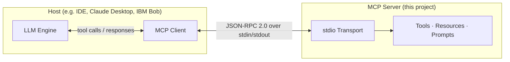
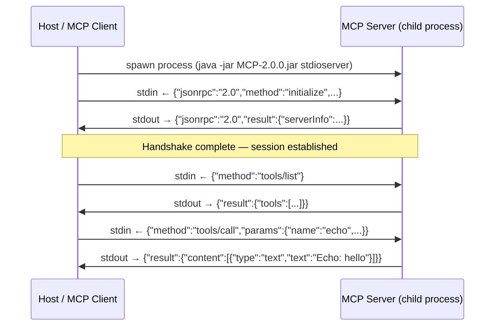
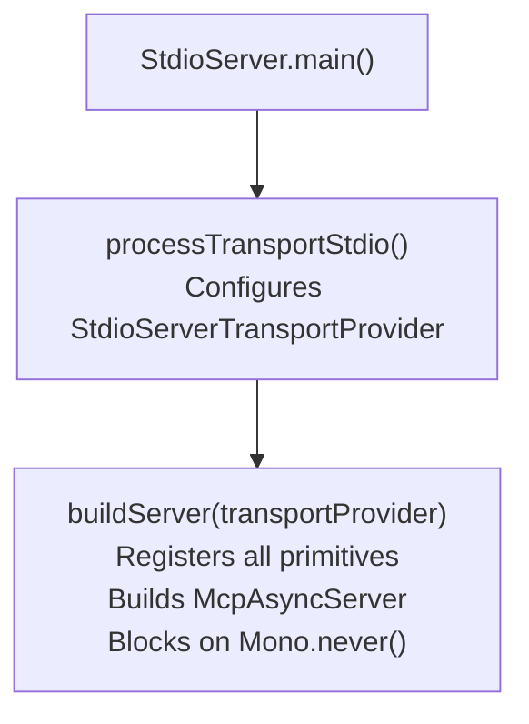
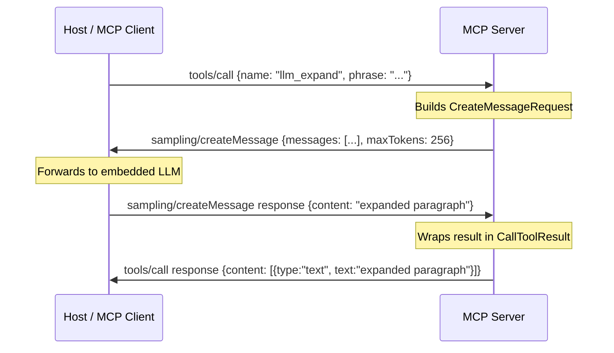
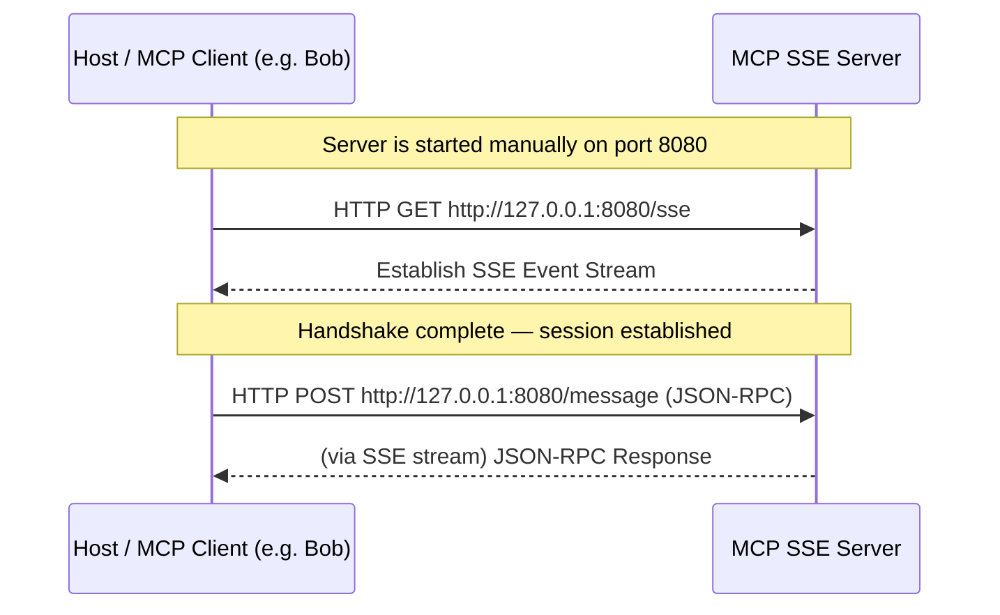
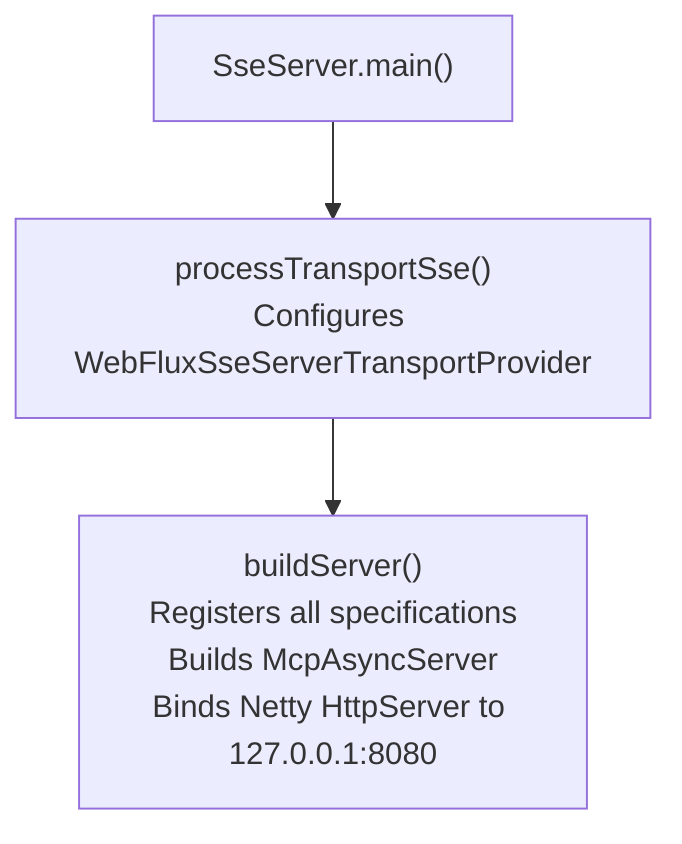
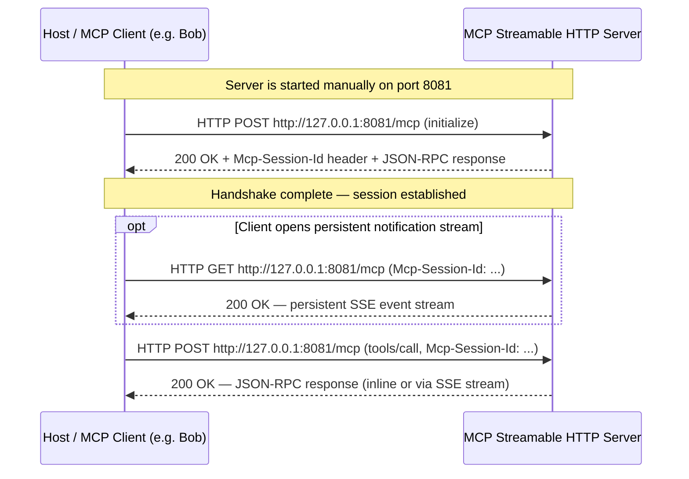
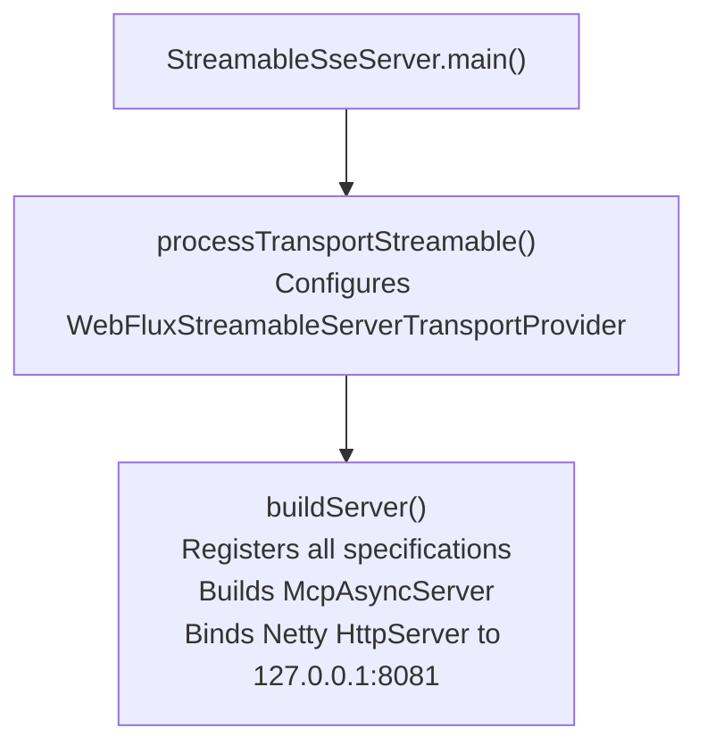

# Model Context Protocol (MCP) Java Tutorial

Welcome to the **MCP Java SDK Tutorial** repository! This project serves as a comprehensive reference implementation and step-by-step guide for developers looking to master the official [Model Context Protocol (MCP) Java SDK](https://github.com/modelcontextprotocol/java-sdk).

---

## Summary

The primary objective of this project is to provide a complete, hands-on tutorial for building, running, and diagnosing Model Context Protocol (MCP) components in a native Java environment. The project explores the full potential of the official Java MCP SDK through two primary deliverables:

1. **A Compliant MCP Server**:
   A robust, standard-compliant MCP server that exposes the four core MCP primitives: **Tools**, **Resources**, **Prompts**, and **Sampling**. The tutorial guides you through wrapping these primitives in **three** independent transport layers — standard I/O (stdio), legacy HTTP+SSE, and modern Streamable HTTP — demonstrating how LLMs and host clients can securely interoperate with Java-based backend services.

2. **A Universal MCP Client (Feature Dumper)**:
   A native Java MCP client designed to connect to the tutorial's server, or **any other compliant MCP server**. Once connected, this client queries and dumps all available capabilities, tools, resources, and prompts exposed by the target server into a clean, structured diagnostic report. This "Feature Dumper" client acts as an essential inspection tool, similar to the Node-based MCP Inspector, but fully native to Java.

### Key Learnings & Stack

This tutorial implements the design principles and learnings from [`doc/Research.md`](doc/Research.md):
* **Modern Java Platform**: Leverages the power of **Java 21** (virtual threads, records, and pattern matching) and **Maven**.
* **Reactive Core**: Utilizes Project Reactor Netty for seamless reactive streams and SSE network communication.
* **Production-Grade Logging**: Configured with Log4j2 and SLF4J to support clean, non-conflicting diagnostics (especially when using standard I/O transport pipelines where system stdout is reserved for JSON-RPC payloads).
* **Single-POM Versioning**: Centralized dependency properties for robust and reproducible builds.

---

## Current Status & Getting Started

### Prerequisites

Ensure your local environment is configured to execute:
* Node (when using [MCP Inspector](https://modelcontextprotocol.io/docs/2026-07-28/tools/inspector/web))
* Git
* Maven
* JDK21

### Build the Project

Build the executable fat-JAR:
```bash
mvn clean package
```

### Verify the Installation

Run the launcher without any arguments to see the help text and verify that the core MCP SDK classes load successfully:

```bash
java -jar target/MCP-2.0.0.jar
```

---

## Launcher & Transport Comparison

The entry point `java -jar target/MCP-2.0.0.jar` routes to different components depending on the subcommand and arguments passed. Below is a detailed breakdown of how the three server transports and the client differ.

### Comparison Table

| Attribute | `stdioserver` | `sseserver` | `streamableserver` | `client` |
| :--- | :--- | :--- | :--- | :--- |
| **Primary Role** | Local Server (Stdio) | Network Server (SSE) | Network Server (Streamable HTTP) | Diagnostic Universal Client |
| **How to Launch** | Spawned as a child process by an MCP host. | Started manually or as a background daemon. | Started manually or as a background daemon. | Executed as a CLI tool to query capabilities. |
| **Parameters Accepted** | None. | None. | None. | Dynamic based on chosen client mode (see below). |
| **Connection Port** | None — uses `stdin`/`stdout` stream redirection. | Binds to `127.0.0.1:8080`. | Binds to `127.0.0.1:8081`. | Connects to port `8080` (SSE), `8081` (Streamable), or launches a child process (stdio). |
| **MCP Spec** | 2024-11-05 | 2024-11-05 | **2025-03-26** | Adapts to the connected server. |
| **Endpoints** | `stdin` / `stdout` | `GET /sse`, `POST /message` | `GET /mcp`, `POST /mcp` (unified) | N/A |
| **Lifecycle** | Interlocked with the host (auto-terminates when host exits). | Persistent (must be stopped manually with `Ctrl+C`). | Persistent (must be stopped manually with `Ctrl+C`). | Ephemeral (prints diagnostic dump and exits). |
| **Output Streams** | All output via Log4j2: startup banner → `stdout`, WARN+ logs → `stderr`, all levels → `MCP.log`. `stdout` is otherwise reserved exclusively for JSON-RPC. | All output via Log4j2: startup banner → `stdout`, WARN+ logs → `stderr`, all levels → `MCP.log`. | All output via Log4j2: startup banner → `stdout`, WARN+ logs → `stderr`, all levels → `MCP.log`. | Diagnostic dump via `System.out.println` directly to `stdout`. |

---

## Starting the Servers

### 1. Launch MCP Server over Stdio
Designed to run purely as an embedded subprocess. **Never launch this manually to interact with it directly**, as your terminal keystrokes will corrupt the JSON-RPC stream framing.

```bash
java -jar target/MCP-2.0.0.jar stdioserver
```

### 2. Launch MCP Server over Server-Sent Events (SSE)
Launches a standalone Reactor Netty server on local port `8080`. Uses the **legacy MCP Spec 2024-11-05** two-endpoint model.

```bash
java -jar target/MCP-2.0.0.jar sseserver
```

### 3. Launch MCP Server over Streamable HTTP
Launches a standalone Reactor Netty server on local port `8081`. Uses the **modern MCP Spec 2025-03-26** single-endpoint model. This is the recommended transport for new integrations.

```bash
java -jar target/MCP-2.0.0.jar streamableserver
```

---

## Using the Universal Diagnostic Client

The client subcommand supports three entirely separate syntax tracks depending on whether you want to connect to a local **Stdio server subprocess**, a remote **SSE server**, or a remote **Streamable HTTP server**.

### Option 1: Local Stdio Server (Subprocess Mode)
In this mode, the client launches an MCP server as a local child process and talks to it over stdin/stdout.

```bash
java -jar target/MCP-2.0.0.jar client [command] [args...]
```

#### Mode A: Internal Loopback (Omit All Parameters)
If you run the client with **no arguments**, it automatically boots the internal StdioServer packaged inside the same fat JAR, establishes a direct loopback channel, queries all capabilities, runs demonstration echos, and prints the report.
* **`[command]`**: Omitted.
* **`[args...]`**: Omitted.

```bash
java -jar target/MCP-2.0.0.jar client
```

#### Mode B: Custom Stdio Subprocess (Provide Command)
If you specify a command, the client spawns `[command] [args...]` as a child process and handshakes with it over that process's `stdin`/`stdout`. The child must be a compliant MCP server that speaks the stdio transport.
* **`[command]`** (Required): The interpreter or runtime executable to launch (e.g. `node`, `python`, `java`). This is only the launcher — on its own it is not an MCP server. You must also supply the script or JAR to run via `[args...]`.
* **`[args...]`** (Required in practice): The script, JAR, or class name — plus any flags — passed to the launcher. Together with `[command]` these form the full subprocess command line.

```bash
# Spawns our own StdioServer class explicitly as a custom subprocess
java -jar target/MCP-2.0.0.jar client java -cp target/MCP-2.0.0.jar edu.java.service.StdioServer

# Spawns an external Node.js MCP server
java -jar target/MCP-2.0.0.jar client node /path/to/mcp-server.js

# Spawns an external Python MCP server
java -jar target/MCP-2.0.0.jar client python /path/to/mcp_server.py
```

---

### Option 2: Remote SSE Server (Network Mode)
In this mode, the client connects over the network to a running standalone HTTP+SSE server.

```bash
java -jar target/MCP-2.0.0.jar client sse [url]
```

#### Mode C: Remote SSE Handshake
By providing the literal keyword `sse`, the client activates the legacy SSE transport instead of spawning a local process.
* **`sse`** (Required Keyword): Instructs the client to use the `HttpClientSseClientTransport` layer.
* **`[url]`** (Optional Parameter): The **base** URL — `scheme://host:port` with **no path**. **Defaults to `http://127.0.0.1:8080`** if omitted. The transport hardcodes `/sse` as the connection path and negotiates the message endpoint dynamically from the server's SSE `endpoint` event. Passing a URL that already contains a path (e.g. `http://host:8080/sse`) would cause the transport to connect to `http://host:8080/sse/sse` — which is wrong.

```bash
# Connect to the default local SSE Server (127.0.0.1:8080)
java -jar target/MCP-2.0.0.jar client sse

# Connect to an SSE Server running on a custom address/port
java -jar target/MCP-2.0.0.jar client sse http://127.0.0.1:9090
```

---

### Option 3: Remote Streamable HTTP Server (Network Mode)
In this mode, the client connects over the network to a running standalone Streamable HTTP server (MCP Spec 2025-03-26).

```bash
java -jar target/MCP-2.0.0.jar client streamable [url]
```

#### Mode D: Remote Streamable HTTP Handshake
By providing the literal keyword `streamable`, the client activates the modern Streamable HTTP transport.
* **`streamable`** (Required Keyword): Instructs the client to use the `HttpClientStreamableHttpTransport` layer.
* **`[url]`** (Optional Parameter): The **base** URL — `scheme://host:port` with **no path**. **Defaults to `http://127.0.0.1:8081`** if omitted. The `/mcp` endpoint path is appended automatically by the transport builder (`.endpoint("/mcp")`). Passing a URL that already contains a path (e.g. `http://host:8081/mcp`) would cause the transport to resolve to `http://host:8081/mcp/mcp` — which is wrong.

```bash
# Connect to the default local Streamable HTTP Server (127.0.0.1:8081)
java -jar target/MCP-2.0.0.jar client streamable

# Connect to a Streamable HTTP Server running on a custom address/port
java -jar target/MCP-2.0.0.jar client streamable http://127.0.0.1:9091
```

---

## Integrating with MCP Hosts

### Test with MCP Inspector
The official Node-based [MCP Inspector](https://modelcontextprotocol.io/docs/2026-07-28/tools/inspector/web) provides an interactive browser UI for debugging. Run it by pointing to the target Stdio class:

```bash
npx @modelcontextprotocol/inspector@latest java -cp target/MCP-2.0.0.jar edu.java.service.StdioServer
```

### Register Stdio in IBM Bob IDE
To register the Stdio server inside your AI assistant / Bob host environment, insert this snippet into your host settings:

```json
{
  "mcpServers": {
    "mcp-test-stdio": {
      "command": "X:\\Path\\Java\\Java21\\bin\\java.exe",
      "args": [
        "-jar",
        "X:\\Path\\MCP\\target\\MCP-2.0.0.jar",
        "stdioserver"
      ],
      "cwd": "D:\\Workspace WCA\\MCP",
      "disabled": false,
      "alwaysAllow": [
        "echo",
        "add",
        "current_time",
        "llm_expand"
      ]
    }
  }
}
```

### Register SSE in IBM Bob IDE
To register the standalone SSE server inside your assistant, ensure the `sseserver` is running, then add:

```json
{
  "mcpServers": {
    "mcp-test-sse": {
      "url": "http://127.0.0.1:8080/sse",
      "cwd": "D:\\Workspace WCA\\MCP",
      "disabled": false,
      "alwaysAllow": [
        "echo",
        "add",
        "current_time",
        "llm_expand"
      ]
    }
  }
}
```

### Register Streamable HTTP in IBM Bob IDE
To register the standalone Streamable HTTP server inside your assistant, ensure the `streamableserver` is running, then add:

```json
{
  "mcpServers": {
    "mcp-test-streamable": {
      "url": "http://127.0.0.1:8081/mcp",
      "cwd": "D:\\Workspace WCA\\MCP",
      "disabled": false,
      "alwaysAllow": [
        "echo",
        "add",
        "current_time",
        "llm_expand"
      ]
    }
  }
}
```

---

## Compatibility

> *Researched on 2026-08-20. MCP host support is evolving rapidly; verify against the latest release notes of each tool.*

Not all MCP hosts implement the full specification. The table below documents which of the four MCP primitives/capabilities are supported by commonly used AI coding hosts and inspection tools.

| Host | MCP Primitive: Tools | MCP Primitive: Resources | MCP Primitive: Prompts | MCP Capability: Sampling |
|---|:---:|:---:|:---:|:---:|
| **IBM Bob** | ✅ | ✅ | ❌ | ❌ |
| **Claude Desktop** | ✅ | ✅ | ✅ | ✅ |
| **Claude Code** | ✅ | ✅ | ✅ | ❌ |
| **OpenAI Codex CLI** | ✅ | ❌ | ❌ | ❌ |
| **GitHub Copilot (VS Code)** | ✅ | ❌ | ❌ | ❌ |
| **MCP Inspector** | ✅ | ✅ | ✅ | ❌ |
| **This project's Java Client** | ✅ | ✅ | ✅ | ✅* |

> \* The Java Client in this project can declare sampling capabilities in the handshake, making it one of the few clients capable of exercising the full Sampling flow end-to-end (see `llm_expand`).

---

## Technical Documentation

This section provides deep technical overviews of the three available transport layers in this project: the **stdio transport**, the **HTTP+SSE transport**, and the **Streamable HTTP transport**.

---

## Technical Documentation — stdio Transport

This section documents the MCP server running over the **stdio transport**.

---

### MCP Architecture Overview

MCP follows a **client–host–server** model. The host is the AI application (e.g. an IDE plugin or CLI tool); it embeds the MCP client and is responsible for managing the connection to one or more MCP servers.



---

### MCP Primitives

The MCP specification defines three **primitives** that a server exposes, plus one **capability** that a server can invoke on the client:

| Concept | Type | Direction | Purpose |
|---|---|---|---|
| **Tools** | Primitive | Client calls server | Executable functions the LLM can invoke |
| **Resources** | Primitive | Client reads server | Data the LLM can read (files, DB results, …) |
| **Prompts** | Primitive | Client requests server | Reusable prompt templates |
| **Sampling** | Capability | Server calls client | Server asks the client's LLM to generate text |

---

### Stdio Transport

#### What it is

The **stdio transport** is the simplest MCP transport. The MCP client launches the server as a **child process** and communicates with it over the child's standard input (`stdin`) and standard output (`stdout`). All messages are JSON-RPC 2.0 encoded, one per line.



#### Why stdout must stay clean

Because the host reads every byte written to stdout and attempts to parse it as a JSON-RPC message, **the server must never write anything to `System.out` directly**. Even a single stray `System.out.println()` breaks the JSON-RPC framing and causes a parse error on the client side.

All server-side diagnostics are written to `System.err` (which the host does not read) and to `MCP.log` (configured via Log4j2).

---

### Code Structure

#### Entry point split: transport vs. primitives

A deliberate design decision separates transport selection from primitive registration:



This means adding a new transport in the future requires only a new `processTransport*()` method — the primitive registration in `buildServer()` is reused unchanged.

#### Factory method naming convention

Every MCP service is constructed by a dedicated private factory method. The name encodes both the MCP concept and the service name:

| Prefix | MCP concept | Example |
|---|---|---|
| `createTool*()` | Tool primitive | `createToolEcho()` |
| `createSampling*()` | Sampling capability (registered as a Tool) | `createSamplingLlmExpand()` |
| `createResource*()` | Resource primitive (concrete URI) | `createResourceInfo()` |
| `createResourceTemplate*()` | Resource Template (URI pattern, metadata only) | `createResourceTemplateEcho()` |
| `createPrompt*()` | Prompt primitive | `createPromptCodeReview()` |

The `buildServer()` method then reads as a clean index:

```java
buildServer(transport):
  // Tools
  var toolEcho        = createToolEcho();
  var toolAdd         = createToolAdd();
  var toolCurrentTime = createToolCurrentTime();
  // Sampling
  var toolLlmExpand   = createSamplingLlmExpand();
  // Resources
  var resourceInfo             = createResourceInfo();
  var resourceSystemProperties = createResourceSystemProperties();
  var resourceEchoHello        = createResourceEchoHello();
  var resourceEchoJunit        = createResourceEchoJunit();
  // Resource Templates
  var resourceTemplateEcho = createResourceTemplateEcho();
  // Prompts
  var promptCodeReview = createPromptCodeReview();
  var promptSummarise  = createPromptSummarise();

  McpServer.async(transport)
    .tools(toolEcho, toolAdd, toolCurrentTime, toolLlmExpand)
    .resources(resourceInfo, resourceSystemProperties, resourceEchoHello, resourceEchoJunit)
    .resourceTemplates(resourceTemplateEcho)
    .prompts(promptCodeReview, promptSummarise)
    .build();
```

---

### Registered MCP Primitives

#### Tools

| Name | Description |
|---|---|
| `echo` | Echoes the `message` argument back prefixed with `"Echo: "`. Smoke-test tool. |
| `add` | Parses integer arguments `a` and `b`, returns their sum. Returns an MCP error result (not a thrown exception) on parse failure. |
| `current_time` | Returns the current server UTC timestamp in ISO-8601 format. Accepts no parameters. |
| `llm_expand` | Sampling-backed tool — see [Sampling](#sampling) below. |

#### Resources

Resources are server-side data that a client can read. Each resource has a fixed URI and a **read handler** — a function the SDK calls when a `resources/read` request arrives for that URI.

| URI | MIME type | Description |
|---|---|---|
| `mcp://poc/info` | `text/plain` | Server name, SDK, and JVM version (read at request time) |
| `mcp://poc/system-properties` | `application/json` | All JVM system properties as a JSON object |
| `mcp://poc/echo/Hello-From-Resource-Template` | `text/plain` | Static resource whose URI conforms to the echo template; echoes the final path segment |
| `mcp://poc/echo/junit-test` | `text/plain` | Same handler; used by the JUnit integration test |

#### Resource Templates

A Resource Template is **metadata only** — it advertises a URI pattern to clients via `resourceTemplates/list` but carries no read handler.

| URI pattern | Description |
|---|---|
| `mcp://poc/echo/{message}` | Advertises that the server understands this URI shape. In SDK 0.9.0 only the two pre-registered concrete URIs can actually be read; the template itself performs no routing. |

> **Note:** In MCP Java SDK 0.11.0, `resources/read` is routed by **exact URI lookup** — not by template pattern matching. A `ResourceTemplate` is purely an advertisement.

#### Prompts

| Name | Required arguments | Optional arguments | Description |
|---|---|---|---|
| `code_review` | `language`, `code` | — | Returns a two-message prompt asking the LLM to review the supplied code snippet |
| `summarise` | `text` | `points` (default `"5"`) | Returns a single-message prompt asking the LLM to summarise text into N bullet points |

---

### Sampling

Sampling is a **capability**, not a primitive. Instead of the server exposing something to the client, the server **calls back to the client** and asks the client's LLM to generate text.

The flow for the `llm_expand` tool:



The server is registered as a Tool (`AsyncToolSpecification`) because the MCP SDK has no dedicated "sampling primitive" type — Sampling is a capability the server invokes on the exchange object, not a service it registers. The `createSampling*()` naming convention makes this distinction visible in the code.

---

### Reactive Runtime (Mono / Project Reactor)

The MCP Java SDK is built on **Spring WebFlux** and **Project Reactor**. All message handling runs on a small reactive thread pool — no thread ever blocks waiting for I/O. As a consequence, every handler must return a `Mono<T>` instead of a plain value.

`Mono<T>` represents a computation that will eventually produce zero or one result:

```java
// Synchronous result wrapped in a Mono — the SDK subscribes and unwraps it
return Mono.just(new CallToolResult(...));

// Asynchronous: the SDK calls exchange.createMessage() which returns a Mono;
// .map() transforms the result when it arrives, without blocking
return exchange.createMessage(request).map(result -> new CallToolResult(...));

// Keep the main thread alive without spinning — Mono.never() never emits or completes
Mono.never().block();
```

The server's main thread is parked on `Mono.never().block()` at the end of `buildServer()`. This is intentional: the stdio transport runs on background threads managed by Reactor. If `main()` were to return, those threads would be torn down and the server would exit.

---

## Technical Documentation — sse Transport

The **Server-Sent Events (SSE/HTTP) transport** runs as a standalone network web server over HTTP. Unlike stdio, it operates over TCP/IP, allowing multiple network clients to connect simultaneously and permitting the server to run in a decoupled, containerized, or remote network environment.

---

### SSE Transport Architecture

The HTTP+SSE transport establishes a persistent unidirectional channel where the server pushes events to the client, and a separate POST endpoint for client-to-server messages:

1. **GET `/sse` (Server-Sent Events Stream):** The client (e.g., Bob) establishes a persistent network connection. The server pushes event stream packets (including the assigned `session ID` and the target message endpoint) to the client.
2. **POST `/message` (Client-to-Server Messages):** The client sends JSON-RPC 2.0 requests as HTTP POST request bodies to execute tools, read resources, or fetch prompt templates.



---

### Lifecycle and Localhost Constraints

Unlike the stdio transport (which automatically spawns and kills the server process on-demand), the SSE server operates independently:
* **Manual Lifecycle Management:** The server must be manually started (via `java -jar target/MCP-2.0.0.jar sseserver`) before any client attempts to connect, and must be manually terminated (via `Ctrl+C` or a process signal).
* **Strict Security Constraints:** To adhere to local security guidelines outlined in `security.md`, `SseServer.java` binds strictly to the local loopback address `127.0.0.1` and listens on port `8080`. It never binds to `0.0.0.0` (all interfaces) to protect the server's tools and environment from unauthorized network exposure.

---

### Code Structure (SseServer)

`SseServer.java` is structured with the exact same separation of concerns as StdioServer, reusing the exact same primitive factory methods to ensure **100% feature parity** and simplify maintenance:



#### Registered primitives over SSE:
* **Tools:** `echo`, `add`, `current_time`
* **Resources:** `info` (labeled as SseServer), `system-properties`, `echo` (template instance), `junit-test` (template instance)
* **Resource Templates:** `mcp://poc/echo/{message}`
* **Prompts:** `code_review`, `summarise`
* **Sampling:** Supported via the `llm_expand` tool, which triggers a `sampling/createMessage` request sent as an SSE packet back to the connected client for text generation.

---

### Bob Client Configuration (SSE)

To register this SSE server inside Bob's MCP configuration, use the `"sse"` transport configuration type and point to the base URL (which hosts `/sse` and `/message` under the hood):

```json
{
  "mcpServers": {
    "mcp-poc-sse": {
      "url": "http://127.0.0.1:8080",
      "disabled": false,
      "alwaysAllow": []
    }
  }
}
```


---

## Technical Documentation — Streamable HTTP Transport

The **Streamable HTTP transport** is the modern, unified HTTP transport introduced with **MCP Spec 2025-03-26**. It supersedes the legacy HTTP+SSE transport and condenses the two-endpoint model into a single `/mcp` endpoint that handles all JSON-RPC traffic.

---

### Streamable HTTP vs. Legacy SSE — Key Differences

| Aspect | Legacy SSE (Spec 2024-11-05) | Streamable HTTP (Spec 2025-03-26) |
|---|---|---|
| **Endpoints** | `GET /sse` + `POST /message` (two separate URLs) | `GET /mcp` + `POST /mcp` (single unified URL) |
| **Client→Server messages** | HTTP POST to a separate `/message` endpoint | HTTP POST to the same `/mcp` endpoint |
| **Server→Client messages** | Persistent SSE stream opened via `GET /sse` | Optional SSE stream opened via `GET /mcp`, or inline JSON in the POST response |
| **Session negotiation** | Session ID delivered via the SSE `endpoint` event | Session ID returned in `Mcp-Session-Id` response header |
| **SDK class (server)** | `WebFluxSseServerTransportProvider` | `WebFluxStreamableServerTransportProvider` |
| **SDK class (client)** | `HttpClientSseClientTransport` | `HttpClientStreamableHttpTransport` |
| **Port (this project)** | `8080` | `8081` |

---

### Streamable HTTP Architecture

The client can choose to open a persistent SSE subscription (GET) or operate purely in request–response mode (POST). Both directions share the same `/mcp` endpoint:



---

### Lifecycle and Localhost Constraints

Identical to the SSE transport:
* **Manual Lifecycle Management:** The server must be started (`java -jar target/MCP-2.0.0.jar streamableserver`) before any client connects, and stopped manually via `Ctrl+C` or a process signal.
* **Strict Security Constraints:** `StreamableSseServer.java` binds exclusively to `127.0.0.1:8081`. It never binds to `0.0.0.0`.

---

### Code Structure (StreamableSseServer)

`StreamableSseServer.java` is a direct subclass of `Server.java`, structured identically to `SseServer.java` — only the transport provider class and port constant differ:



The server builder call mirrors SseServer exactly — the only difference is the transport provider type:

```java
// SseServer — two endpoints
WebFluxSseServerTransportProvider transportProvider = WebFluxSseServerTransportProvider.builder()
        .objectMapper(objectMapper)
        .sseEndpoint("/sse")
        .messageEndpoint("/message").build();

// StreamableSseServer — single unified endpoint
WebFluxStreamableServerTransportProvider transportProvider = WebFluxStreamableServerTransportProvider.builder()
        .objectMapper(objectMapper)
        .messageEndpoint("/mcp").build();
```

#### Registered primitives over Streamable HTTP:
* **Tools:** `echo`, `add`, `current_time`
* **Resources:** `info` (labeled as StreamableSseServer), `system-properties`, `echo` (template instance), `junit-test` (template instance)
* **Resource Templates:** `mcp://poc/echo/{message}`
* **Prompts:** `code_review`, `summarise`
* **Sampling:** Supported via the `llm_expand` tool — the server triggers a `sampling/createMessage` request on the exchange, which the client's host LLM services and returns inline.

---

### Bob Client Configuration (Streamable HTTP)

To register this Streamable HTTP server inside Bob's MCP configuration, point to the unified `/mcp` endpoint:

```json
{
  "mcpServers": {
    "mcp-poc-streamable": {
      "url": "http://127.0.0.1:8081/mcp",
      "disabled": false,
      "alwaysAllow": []
    }
  }
}
```
