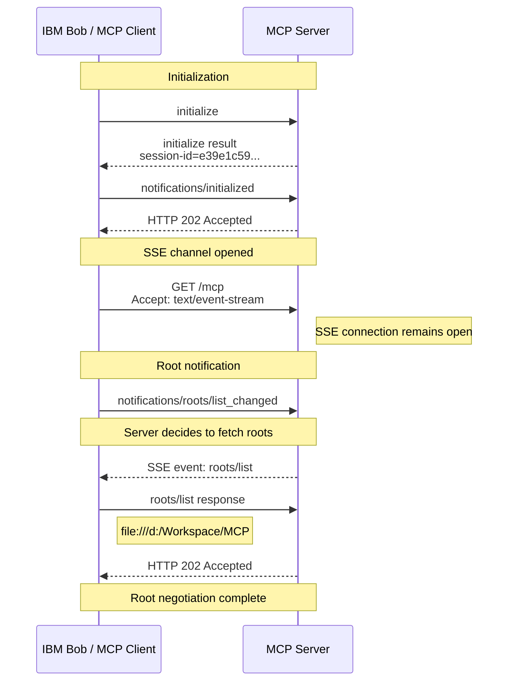

# MCP Session Initialization

---

This section describes the very first interaction between IBM Bob and the MCP server. The goal of this phase is for both sides to learn what the other side supports before any tools, resources, or prompts are used.

Before a client can invoke tools, read resources, or use prompts, both sides must agree on:

* Which MCP protocol version will be used.
* Which capabilities the client supports.
* Which capabilities the server supports.
* Which session identifier will represent this conversation.

Initialization is therefore the MCP equivalent of a handshake.

## Step 1: Bob sends `initialize`

When Bob starts using the MCP server, it sends an HTTP `POST` request to the MCP endpoint:

```http
POST /mcp HTTP/1.1
Host: 127.0.0.1:9081
Content-Type: application/json
Accept: application/json, text/event-stream
```

This tells the server:

> I can handle normal JSON responses or SSE stream responses."

This becomes important later in the protocol. 
The JSON-RPC payload is:

```json
{
  "method": "initialize",
  "params": {
    "protocolVersion": "2025-11-25",
    "capabilities": {
      "roots": {
        "listChanged": true # The client is able to handle roots/list_changed notifications
      }
    },
    "clientInfo": {
      "name": "mcp-use",
      "title": "mcp-use",
      "version": "1.33.0",
      "description": "mcp-use is a complete TypeScript framework for building and using MCP",
      "icons": [
        {
          "src": "https://mcp-use.com/logo.png"
        }
      ],
      "websiteUrl": "https://mcp-use.com"
    }
  },
  "jsonrpc": "2.0",
  "id": 0
}
```

Bob is essentially saying:

> Hello, I am an MCP client. I support MCP protocol version 2025-11-25. Here are my capabilities and client details. Please tell me what you support.

Important fields:

| Field                | Meaning                                                 |
| -------------------- | ------------------------------------------------------- |
| `method: initialize` | Starts the MCP session.                                 |
| `protocolVersion`    | MCP protocol version the client wants to use.           |
| `capabilities`       | Features supported by the client.                       |
| `clientInfo`         | Information about the MCP client implementation.        |
| `id: 0`              | JSON-RPC request identifier used to match the response. |

## Step 2: MCP Server responds to initialize

The server responds with HTTP 200 OK:

```http
HTTP/1.1 200 OK
Content-Type: application/json
Mcp-Session-Id: e39e1c59-8c3d-4f6f-b9fe-823a7fca3c80
```

The response payload contains:

```json
{
  "jsonrpc": "2.0",
  "id": 0,
  "result": {
    "protocolVersion": "2025-11-25",
    "capabilities": {
      "logging": { # The server supports logging operations.
      },
      "prompts": {
        "listChanged": true # Meaning the server can notify the client when the prompt list changes.
      },
      "resources": {
        "subscribe": false, # Resource subscriptions are not supported
        "listChanged": true # Resource list changes can be reported
      },
      "tools": {
        "listChanged": true # Meaning tool changes can be reported later.
      }
    },
    "serverInfo": {
      "name": "MCP Java SDK StreamableHttpServer",
      "title": "MCP Java SDK   Streamable HTTP Reference Server",
      "version": "2.0.1",
      "description": "MCP Java SDK reference implementation over Streamable HTTP transport (MCP Spec 2025-03-26). Exposes echo/add/time tools, static resources, a resource template, code-review and summarise prompts, and an LLM-expansion sampling capability."
    }
  }
}
```

The server is essentially saying:

> I accept your protocol version. Here is the session identifier and here are the MCP features that I support.

## Step 3: Session establishment

One very important piece of information returned by the server is:

> Mcp-Session-Id: e39e1c59-8c3d-4f6f-b9fe-823a7fca3c80

This session ID uniquely identifies the MCP session. Bob must include this value in subsequent requests:

```
mcp-session-id: e39e1c59-8c3d-4f6f-b9fe-823a7fca3c80
```

Without this header, the server would not know which MCP session the request belongs to.

## Step 4: Bob acknowledges initialization

After receiving the server's capabilities, Bob sends another request:

```http
POST /mcp HTTP/1.1
Host: 127.0.0.1:9081
Content-Type: application/json
Accept: application/json, text/event-stream
mcp-session-id: e39e1c59-8c3d-4f6f-b9fe-823a7fca3c80
mcp-protocol-version: 2025-11-25
```

with the payload:

```json
{
  "method": "notifications/initialized",
  "jsonrpc": "2.0"
}
```

The MCP server answers:

```http
HTTP/1.1 202 Accepted
```

with no body.

The meaning is:

> Initialization is complete. The client has understood the server capabilities and is ready to continue."

## Step 5: Bob opens SSE channel

```http
GET /mcp HTTP/1.1
Host: 127.0.0.1:9081
Content-Type: application/json
Accept: text/event-stream
mcp-session-id: e39e1c59-8c3d-4f6f-b9fe-823a7fca3c80
mcp-protocol-version: 2025-11-25
```

This is the moment where Streamable HTTP becomes visible which means *Keep an SSE stream open for asynchronous server messages.*
At this point the client is ready to receive:
* notifications
* requests initiated by the server
* streamed MCP responses

## What has been achieved so far?

At the end of the initialization phase:

1. Bob and the MCP server agreed on protocol version 2025-11-25.
2. The server created an MCP session and returned a session ID.
3. Bob learned that the server supports:
    * Tools
    * Resources
    * Resource templates
    * Prompts
    * Logging capabilities
4. Bob confirmed that initialization completed successfully.
5. The session is now ready for capability discovery (tools/list, resources/list, prompts/list, etc.).

In traditional networking terms, this phase is comparable to a protocol handshake: the client introduces itself, the server introduces itself, and both agree on how future communication will work.

---

# Capability Discovery

Once initialization has completed, Bob knows that the server supports tools, resources, prompts, and resource templates. The next step is to discover exactly what those capabilities are. Bob therefore starts issuing a series of discovery requests. 

## Overview

After the client successfully initializes the MCP session, it starts discovering what the server can do:
1. Discover available tools
2. Discover available prompts
3. Discover available resources
4. Discover available resource templates
Only after this discovery process can the client decide which MCP features to use.
During this phase Bob is not yet executing anything. Instead, it is building a catalog of everything the MCP server makes available.

## Step 1: Discovering Available Tools

Bob sends:

```http
POST /mcp HTTP/1.1
Host: 127.0.0.1:9081
Content-Type: application/json
Accept: application/json, text/event-stream
mcp-session-id: e39e1c59-8c3d-4f6f-b9fe-823a7fca3c80
mcp-protocol-version: 2025-11-25
```

with the payload:

```json
{
  "method": "tools/list",
  "jsonrpc": "2.0",
  "id": 1
}
```

The MCP server responds through the SSE channel:

```json
event:message
data:
    {
        "jsonrpc": "2.0",
        "id": 1,
        "result": {
            "tools": [
            {
                "name": "echo",
                "description": "[MCP Primitives:Tool] Echoes the provided message back to the caller.",
                "inputSchema": {
                "description": "Parameters",
                "type": "object",
                "properties": {
                    "message": {
                    "description": "The text to echo back",
                    "type": "string"
                    }
                },
                "required": [
                    "message"
                ]
                }
            },
            {
                "name": "add",
                "description": "[MCP Primitives:Tool] Adds two integers and returns the sum.",
                "inputSchema": {
                "description": "Two integer operands",
                "type": "object",
                "properties": {
                    "a": {
                    "description": "First integer operand",
                    "type": "string"
                    },
                    "b": {
                    "description": "Second integer operand",
                    "type": "string"
                    }
                },
                "required": [
                    "a",
                    "b"
                ]
                }
            },
            {
                "name": "current_time",
                "description": "[MCP Primitives:Tool] Returns the current server date and time in ISO-8601 format.",
                "inputSchema": {
                "properties": {
                },
                "type": "object"
                }
            },
            {
                "name": "llm_expand",
                "description": "[MCP Capability:Sampling] Asks the LLM to expand a short phrase into a full paragraph.",
                "inputSchema": {
                "description": "Parameters",
                "type": "object",
                "properties": {
                    "phrase": {
                    "description": "The short phrase to expand",
                    "type": "string"
                    }
                },
                "required": [
                    "phrase"
                ]
                }
            }
            ]
        }
    }
```

The tools returned are:

### echo

```text
Name: echo
Description: Echoes the provided message back to the caller.
```

> This is a simple test tool useful for verifying communication.

### add

```text
Name: add
Description: Adds two integers and returns the sum.
```

> This demonstrates a tool accepting parameters and returning a computed result. 

### current_time

```text
Name: current_time
Description: Returns the current server date and time.
```

> This tool provides runtime information from the server.

### llm_expand

```text
Name: llm_expand
Description: Ask the LLM to expand a short phrase into a paragraph.
```

> This demonstrates MCP sampling support. The server can ask an LLM to generate content on its behalf.

---

## Why Bob asks for tools

Before Bob can invoke a tool, it must know:

- the tool name
- what the tool does
- which parameters are required
- the parameter types

The `tools/list` request gives Bob this information dynamically. This allows Bob to work with MCP servers that it has never seen before.

**Note!** Immediately afterward a second `"tools/list"` request is sent.
The server returns the identical tool list.
The reason for this request must be considered unknown.

## Step 2: Discovering Available Prompts

Next Bob sends:

```http
POST /mcp HTTP/1.1
Host: 127.0.0.1:9081
Content-Type: application/json
Accept: application/json, text/event-stream
mcp-session-id: e39e1c59-8c3d-4f6f-b9fe-823a7fca3c80
mcp-protocol-version: 2025-11-25
```

with the payload:

```json
{
  "method": "prompts/list",
  "jsonrpc": "2.0",
  "id": 3
}
```

The MCP server returns two prompt definitions:

```json
event:message
data: 
    {
        "jsonrpc": "2.0",
        "id": 2,
        "result": {
            "tools": [
            {
                "name": "echo",
                "description": "[MCP Primitives:Tool] Echoes the provided message back to the caller.",
                "inputSchema": {
                "description": "Parameters",
                "type": "object",
                "properties": {
                    "message": {
                    "description": "The text to echo back",
                    "type": "string"
                    }
                },
                "required": [
                    "message"
                ]
                }
            },
            {
                "name": "add",
                "description": "[MCP Primitives:Tool] Adds two integers and returns the sum.",
                "inputSchema": {
                "description": "Two integer operands",
                "type": "object",
                "properties": {
                    "a": {
                    "description": "First integer operand",
                    "type": "string"
                    },
                    "b": {
                    "description": "Second integer operand",
                    "type": "string"
                    }
                },
                "required": [
                    "a",
                    "b"
                ]
                }
            },
            {
                "name": "current_time",
                "description": "[MCP Primitives:Tool] Returns the current server date and time in ISO-8601 format.",
                "inputSchema": {
                "properties": {
                    
                },
                "type": "object"
                }
            },
            {
                "name": "llm_expand",
                "description": "[MCP Capability:Sampling] Asks the LLM to expand a short phrase into a full paragraph.",
                "inputSchema": {
                "description": "Parameters",
                "type": "object",
                "properties": {
                    "phrase": {
                    "description": "The short phrase to expand",
                    "type": "string"
                    }
                },
                "required": [
                    "phrase"
                ]
                }
            }
            ]
        }
    }
```

The prompts returned are:

### code_review

```text
Name: code_review
Arguments:
  - language (required)
  - code (required)
```

> Ask the LLM to review a code snippet.

### summarise

```text
Name: summarise
Arguments:
  - text (required)
  - points (optional)
```

> Summarise a block of text into a specified number of bullet points.

## Why prompts are different from tools

Tools execute logic implemented by the MCP server.
Prompts provide reusable prompt templates that can later be sent to an LLM.

For example:

```text
Tool:
  current_time
  -> executes Java code

Prompt:
  code_review
  -> produces an LLM prompt structure
```

Bob therefore discovers both categories separately.

## Step 3: Discovering Available Resources

Bob next sends:

```http
POST /mcp HTTP/1.1
Host: 127.0.0.1:9081
Content-Type: application/json
Accept: application/json, text/event-stream
mcp-session-id: e39e1c59-8c3d-4f6f-b9fe-823a7fca3c80
mcp-protocol-version: 2025-11-25
```

with the payload:

```json
{
  "method": "resources/list",
  "params": {},
  "jsonrpc": "2.0",
  "id": 4
}
```
The server returns several resources.

```json
event:message
data:
    {
        "jsonrpc": "2.0",
        "id": 4,
        "result": {
            "resources": [
            {
                "uri": "mcp://poc/info",
                "name": "MCP Streamable HTTP Server Info",
                "description": "[MCP Primitives:Resource] Return basic information about this MCP PoC server",
                "mimeType": "text/plain"
            },
            {
                "uri": "mcp://poc/system-properties",
                "name": "System Properties",
                "description": "[MCP Primitives:Resource] Return all JVM system properties and environment variables as JSON",
                "mimeType": "application/json"
            },
            {
                "uri": "mcp://poc/echo/Hello-From-Resource-Template",
                "name": "Echo Hello Resource",
                "description": "[MCP Primitives:Resource] Return static resource whose URI conforms to the echo resource template",
                "mimeType": "text/plain"
            },
            {
                "uri": "mcp://poc/echo/junit-test",
                "name": "Echo Junit Resource",
                "description": "[MCP Primitives:Resource] Return static resource whose URI conforms to the echo resource template, used in Junit tests",
                "mimeType": "text/plain"
            }
            ]
        }
    }        
```

The resources returned are:

### MCP Server Info

```text
URI: mcp://poc/info
Mime-Type: text/plain
```

> Provides information about the MCP server itself.

### System Properties

```text
URI: mcp://poc/system-properties
Mime-Type: application/json
```

> Provides JVM system properties and environment variables. This is the resource Bob later reads.

### Echo Hello Resource

```text
URI: mcp://poc/echo/Hello-From-Resource-Template
```

> A sample resource generated from a resource template.

---

### Echo Junit Resource

```text
URI: mcp://poc/echo/junit-test
```

> Another example of a resource generated from the same template.

## Why resources exist

Resources are read-only pieces of data exposed by the server.

Typical examples are:

- configuration data
- source files
- status information
- documents
- JSON data

Unlike tools, resources are generally fetched rather than executed.

## Step 4: Discovering Resource Templates

Bob finally sends:

```http
POST /mcp HTTP/1.1
Host: 127.0.0.1:9081
Content-Type: application/json
Accept: application/json, text/event-stream
mcp-session-id: e39e1c59-8c3d-4f6f-b9fe-823a7fca3c80
mcp-protocol-version: 2025-11-25
```

with the payload:

```json
{
  "method": "resources/templates/list",
  "jsonrpc": "2.0",
  "id": 5
}
```

The MCP server returns:

```json
event:message
data:
    {
        "jsonrpc": "2.0",
        "id": 5,
        "result": {
            "resourceTemplates": [
            {
                "uriTemplate": "mcp://poc/echo/{message}",
                "name": "Echo Resource",
                "description": "[MCP Primitives:Resource] Returns the {message} portion of the URI as plain text",
                "mimeType": "text/plain"
            }
            ]
        }
    }
```
### Echo Message Resource Template

```text
URI: mcp://poc/echo/{message}
Mime-Type: text/plain
```
> Returns the {message} portion of the URI as plain text.

## What a resource template means

A normal resource has a fixed URI:

```text
mcp://poc/system-properties
```

A resource template can generate many resources dynamically:

```text
mcp://poc/echo/Hello
mcp://poc/echo/Test
mcp://poc/echo/Anything
```

All of these match:

```text
mcp://poc/echo/{message}
```

Bob learns that such resources can exist even if they are not individually listed. 

# Result of Capability Discovery

After the discovery phase Bob has learned:

| Capability | Count |
|------------|--------|
| Tools | 4 |
| Prompts | 2 |
| Resources | 4 |
| Resource Templates | 1 |

Specifically, Bob now knows that the server supports:

- Tools: `echo`, `add`, `current_time`, `llm_expand`
- Prompts: `code_review`, `summarise`
- Resources: `info`, `system-properties`, and two echo resources
- Resource template: `mcp://poc/echo/{message}`

With this catalog available, Bob can decide which capability is relevant to the user's request and invoke it.

In the following chapter Bob chooses to read a resource.

---

# Root discovery

A root is the workspace location the MCP client is willing to expose to the MCP server, in this example:

```
file:///d:/Workspace/MCP
```

So Bob is telling the MCP server `This is the workspace I'm currently working with.`.
The server can then use this information when implementing tools, resources, indexing, code analysis, etc.

During initialize, Bob advertises:

```json
      "roots": {
        "listChanged": true # The client is able to handle roots/list_changed notifications
      }
```

this means `I support roots.` and `I can notify you if my roots change.`, but Bob does not send the actual roots yet.
Only the capability is advertised.

During initialization Bob sends:

```http
POST /mcp HTTP/1.1
Host: 127.0.0.1:9081
Content-Type: application/json
Accept: application/json, text/event-stream
mcp-session-id: e39e1c59-8c3d-4f6f-b9fe-823a7fca3c80
mcp-protocol-version: 2025-11-25
```

with the payload:

```json
{
  "method": "notifications/roots/list_changed",
  "jsonrpc": "2.0"
}
```

This is the message that initially looks strange.
At first glance it seems backwards because no roots have been exchanged yet.
Immediately afterward, the MCP server uses the already-open SSE channel and sends:

```json
event:message
data:
    {
        "jsonrpc": "2.0",
        "method": "roots/list",
        "id": "e39e1c59-8c3d-4f6f-b9fe-823a7fca3c80-0",
        "params": {
        }
    }
```

Bob answers the MCP server request (with a new session):

```http
POST /mcp HTTP/1.1
Host: 127.0.0.1:9081
Content-Type: application/json
Accept: application/json, text/event-stream
mcp-session-id: e39e1c59-8c3d-4f6f-b9fe-823a7fca3c80
mcp-protocol-version: 2025-11-25
```

with the payload:

```json
{
  "result": {
    "roots": [
      {
        "uri": "file:///d:/Workspace/MCP"
      }
    ]
  },
  "jsonrpc": "2.0",
  "id": "e39e1c59-8c3d-4f6f-b9fe-823a7fca3c80-0"
}
```

Notice the `id`.
The server request used `e39e1c59-8c3d-4f6f-b9fe-823a7fca3c80-0` and Bob returns `e39e1c59-8c3d-4f6f-b9fe-823a7fca3c80-0`.
This is the standard JSON-RPC request/response correlation mechanism.



## Why doesn't Bob simply send the root

Because in MCP the root list belongs to the client.

The protocol model is:
* Server requests roots
*  Client supplies roots

The MCP client merely announces `My roots changed.` then the MCP server decides whether it actually wants to retrieve them.
Without SSE, the server would have no way to ask:

```json
{
  "method": "roots/list"
}
```

because HTTP by itself is request-response.
The open SSE stream effectively gives the server a communication path back to the client.

--- 

# Example: Read Resource

The user requests: `Using the mcp-test-streamable MCP server invoke the system properties resource!`, so Bob Bob finally sends:

```http
POST /mcp HTTP/1.1
Host: 127.0.0.1:9081
Content-Type: application/json
Accept: application/json, text/event-stream
mcp-session-id: e39e1c59-8c3d-4f6f-b9fe-823a7fca3c80
mcp-protocol-version: 2025-11-25
```

with the payload:

```json
{
  "method": "resources/read",
  "params": {
    "uri": "mcp://poc/system-properties"
  },
  "jsonrpc": "2.0",
  "id": 7
}
```

The MCP server responds with (manually formatted for better readability): 

```json
event:message
data:
    {
        "jsonrpc": "2.0",
        "id": 7,
        "result": {
            "contents": [
                {
                    "uri": "mcp://poc/system-properties",
                    "mimeType": "application/json",
                    "text": 
                        { 
                            "Properties":
                                {
                                    "java.specification.version":"21",
                                    ...
                                    "java.class.version":"65.0"
                                },
                            "Environment":
                                { 
                                    "configsetroot":"C:\\\\WINDOWS\\\\ConfigSetRoot\",
                                    "JAVA":"C:\\\\Programs\\\\Java\\\\Java21\\\\bin\",
                                    ...
                                    "CURRENTDIRECTORY": "d:\\\\Development\\\\\"
                                }
                        }
                }
            ]
        }
    }
```

Notice that MCP resources are returned as a list even though only one resource was requested.
That allows the protocol to support multiple returned content items if necessary.

The resource contains a JSON document with two top-level objects
* Properties (the Properties section comes from `System.getProperties()`)
* Environment (the Environment section comes from `System.getenv()`)

For a demo server this resource is useful.
For a production MCP server this resource would be extremely sensitive as it exposes things such as: `USERNAME`, `COMPUTERNAME`, ...

A subtle thing many newcomers notice the resource MIME type is `"mimeType": "application/json"` but the actual payload appears as string.
Why?
The MCP content model transmits resource contents as content blocks.
In this server implementation the JSON document is serialized into a string and placed into the content block's text field. The client is expected to interpret the content according to the MIME type.
